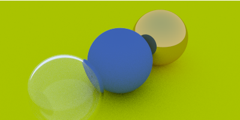

# EdgeComputing

A distributed Ray Tracing engine based on [Ray Tracing in one Weekend](https://www.realtimerendering.com/raytracing/Ray%20Tracing%20in%20a%20Weekend.pdf).

The goal of this project is to learn and achieve a POC about distributed computation.
We chose ray tracing because it's more suitable for the POC we wanted.

## How it works?

The architecture is quite simple. We have a main server which receive the asked scene to render and distribute the computes across the different connected clients.
The server goal is to split the scene into different parts and ask each client to render a part of this scene which can be of a different size depending the capacity of the client,  
as you can imagine a mobile won't render a part of the scene as fast as a desktop computer.


Here is a schema with a main scene and how the scene is divided among clients.
In reality it's a bit more complex than that but it's more easily understandable.


## Ray Tracing

To realise our project, we needed to use a 3d rendering algorithm. We decided to create our own ray tracing algorithm so that we can modify it tour our needs.

A scene config file is used to generate the 3d scene. It describe the shapes, the size and the 3d position of each objects.

## Example

Scenes are json formatted and have to follow some requirements.
Here is an example scene:

In first instance we do provide some information about the global scene (width, height, quality...),
then about the camera (view, angle...) and finally the objects we want to render.
```json
{
    "name": "RayTracer",
    "width": 800,
    "height": 400,
    "depth": 10,
    "camera": {
        "from": {
            "x": 15,
            "y": 1,
            "z": -2
        },
        "at": {
            "x": 0,
            "y": 0,
            "z": 0
        },
        "vUp": {
            "x": 0,
            "y": 1,
            "z": 0
        },
        "vFov": 20,
        "aperture": 0,
        "t0": 0,
        "t1": 1
    },
    "objects": [
        {
            "position": {
                "x": 0,
                "y": -1000,
                "z": 0
            },
            "material": {
                "name": "Lambertian",
                "reflection": {
                    "r": 0.5,
                    "g": 0.5,
                    "b": 0.5
                }
            },
            "radius": 1000
        },
        ....
```

Each object has some properties (reflection, material, size, position...).

Material must be `Dielectric`, `Lambertian` or `Metal`.
The full list is available [here](raytracer/src/Materials).



From left to right: `Dielectric`, `Lambertian` and `Metal`.

You can find some further examples in the [example folder](raytracer/src/config).

